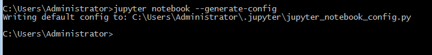
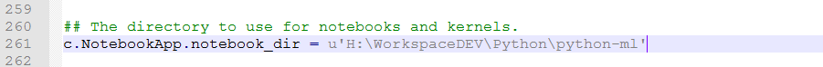
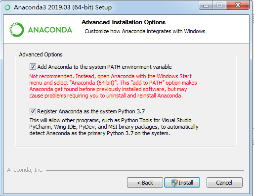

### 基本概念

机器学习 Machine Learning
深度学习
神经网络 NN

### 知识框架
- 数学基础
> 微积分  
> 线性代数  
> 概率统计

- 编程基础
> Python  
> C++  

- 理论基础
> 有监督学习 / 无监督学习  
> 训练集 / 验证集 / 测试集  
> 过拟合  
> 梯度下降法  
> 正则化  
> 代价函数  

- 机器学习算法
> 决策树  
> KNN  
> KMEANS  
> SVM  
> 线性回归  

- 深度学习算法
> BP  
> CNN  
> LSTM  
> GANs  

- 实际应用
> 图像识别  
> 语音识别  
> 自动驾驶  
> 垃圾邮件分类
> 聊天机器人

### Python优点用途
> **优点**：功能强大，开发效率高，应用广泛  
> **用途**：  
>> 数据分析  
科学计算  
机器学习  
深度学习  
可视化界面  
网页开发  
网络爬虫  
脚本  

### Anaconda安装
> https://www.anaconda.com/distribution/  
> 如果没有jupyter_notebook_config.py文件  
> 打开命令提示符执行  
```
jupyter notebook --generate-config
```







## Python机器学习
### 数据挖掘和机器学习的关系
### 训练数据 / 验证数据 / 测试数据
### 监督学习 / 无监督学习 / 半监督学习
### 回归 / 分类 / 聚类